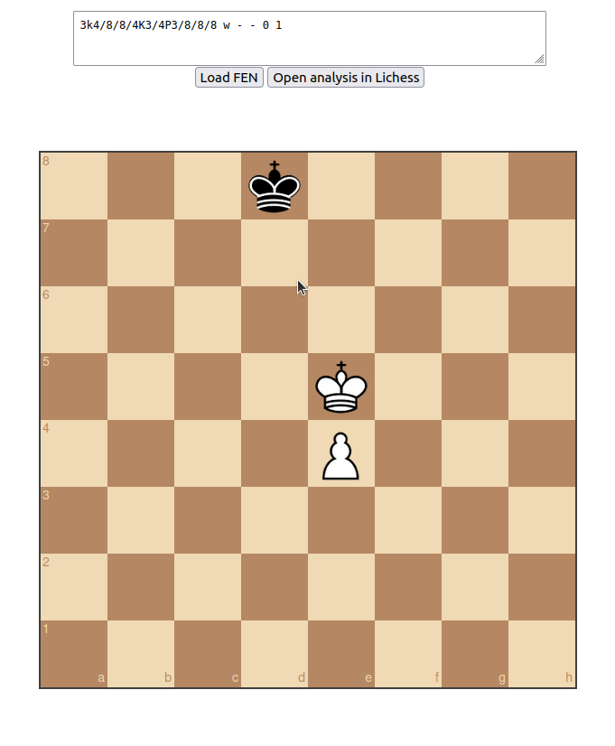

# ♟️ EndPlay: A Chess Bot That Fights Back in Endgames

A deep learning + classical engine hybrid that defends more resiliently than Stockfish alone.

Try the live demo → [endplay.up.railway.app](https://endplay.up.railway.app/)

---

## Why It's Different

Chess engines can be a useful tool for practicing endgames. But they can 'give up' in some positions, because every move is losing.
Stockfish plays the "best" move, even if it trivially allows pawn promotion.
EndPlay plays the most testing, tricky, and resourceful moves — like a strong human would.

This makes EndPlay a powerful training partner when you're trying to convert won endgames against a tough defender.

---

## Example: Promotion Defense

**Stockfish**


Stockfish quickly runs away from the promotion square.

**EndPlay**



I stalemate during my first try. The same position is much tougher to win.

## Features

### Browse preset endgames


### Load your own FEN or analyze in Lichess


## What does it do?
- Uses a CNN trained on master-level endgames
- Predicts human-like responses to avoid 'obvious' defeat
- Combines CNN scoring with Stockfish search
- Deployed as a live web app (Flask + Torch)

## Stack
- **Frontend**: Chessboard.js + vanilla HTML
- **Backend**: Flask, Python-Chess, Torch
- **Model**: Custom ResNet-style CNN which predicts (start, end) maps
- **Deployment**: Railway + Gunicorn

## Future Work
- Add capability for saving custom positions on the sidebar
- Improving model performance, generally
- Creating a spinoff version that plays as white, and pushes for the win
  - the user tries to defend/draw as black
 
### Running Locally
Clone the repo and install dependencies. Consider using a python virtual environment:

```bash
git clone https://github.com/deanzhou/endplay.git
cd endplay
python -m venv venv
source venv/bin/activate
pip install -r requirements.txt
```

Make sure you have Python 3.10+ and a compatible Stockfish binary.
Start the Flask app:
```bash
gunicorn app:app
```
and it should open up as http://localhost:10000 on your browser

### Technical Documentation


