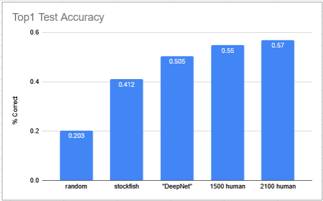
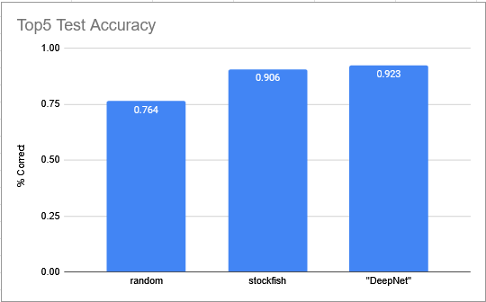

## Benchmarks

### Evaluation Method
I split the chess games data into a train set and a test set. The test set is shuffled 5% of the total cases, or 7k out of 140k test cases.

The inputs are chess positions with Black to play in a losing position. The output is the move that was chosen by the master-level player in that game.

For evaluation, I primarily used Top1 and Top5 accuracy. A prediction would be counted 'correct' if the top choice was the same as the output.
A prediction wouldbe counted 'correct' in top5, if any of the top 5 predictions was the same as the output.

### Benchmark models
I primarily decided on the following models to compare to:
- random: this would simply predict any legal move, at random
- stockfish: this would take stockfish's prediction, which is objectively the 'best' move in the position
- human: for this metric, I personally created a .pdf of the first 100 test cases, and tried my best to guess the move and checked my answers. I only tried for top1 accuracy

### Results
My goal when starting out was to create a model that is better than Stockfish at predicting human-like moves. I thought that this would be relatively trivial.

#### Top1 Accuracy

From this, we can see that random scores about 20%, meaning that there's an average of 5 possible moves for each test case. Human players play the objectively 'best' move about 40% of the time.
My CNN is able to predict the correct move about 50% of the time, which is under human-level performance. 

I manually reviewed the test cases and I would guess the maximum possible human performance is something around 60%, as some of the test cases have symmetry or many equal options.

#### Top5 Accuracy

Here is the top 5 accuracy. My CNN is able to have the top move in it's top5 about 92% of the time.

#### Reflection
My ultimate goal was to have my model perform better than any one human (60%+), but this may require more resources.

I strongly believe that I could attain non-trivial improvement (up to 55% top1 accuracy) simply by gathering more data and increasing the depth of the model. These are both feasible but would require significant training resources.

